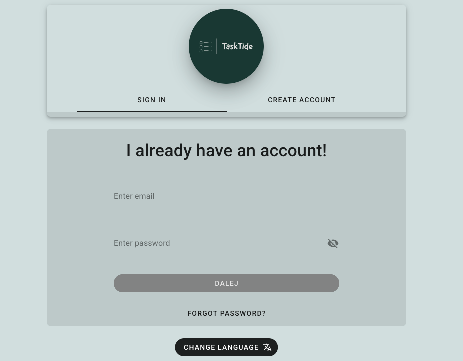
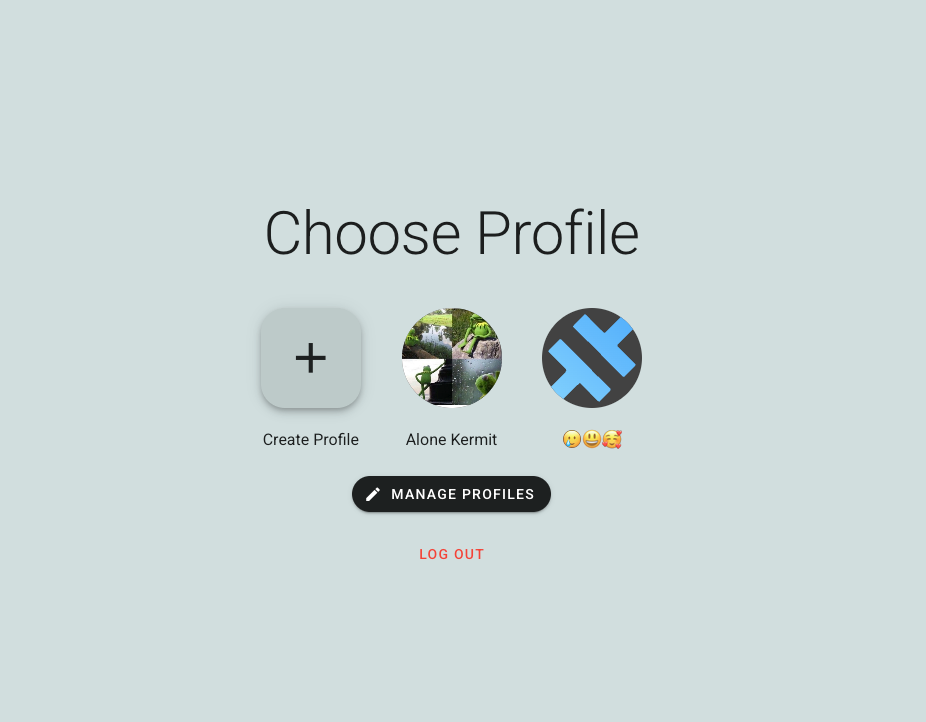
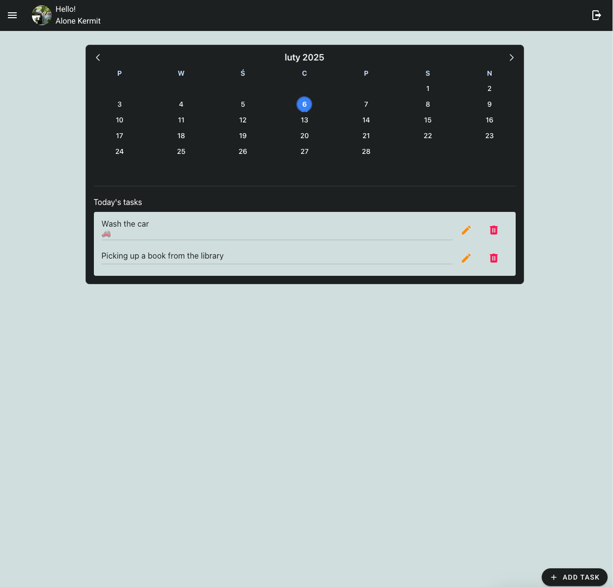
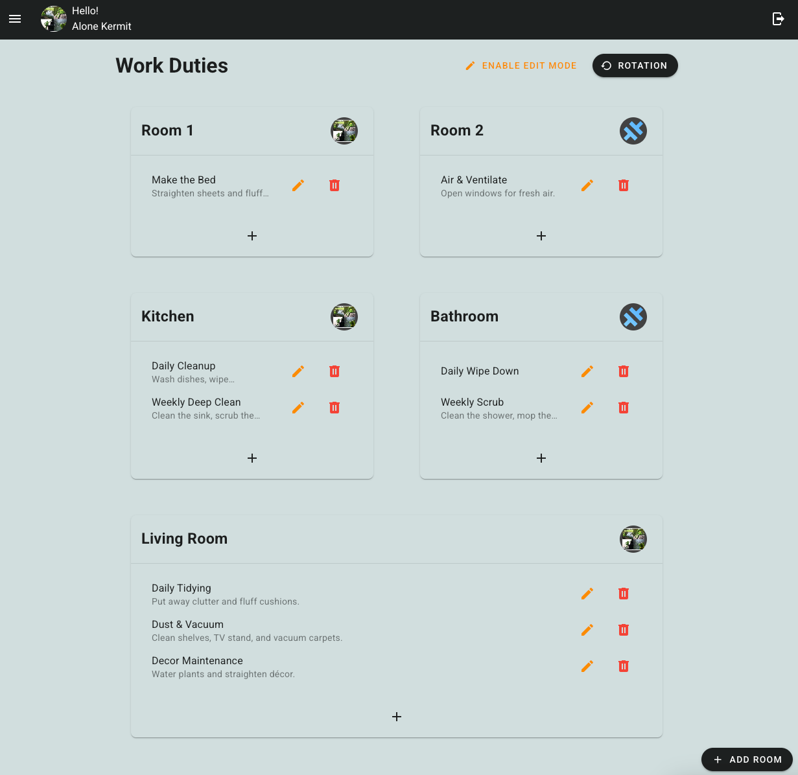

# TaskTide

Link to web application: [click here](https://task-tide-app.netlify.app/auth)

TaskTide is a chore and duty management app designed to help users organize and track their tasks efficiently. Whether for personal use or household management, TaskTide provides a seamless experience for staying on top of daily responsibilities.

## Features

- **Task Management** – Easily create, edit, and delete tasks.
- **Scheduling** – Set due dates.
- **User-Friendly Interface** – Clean and intuitive design for effortless navigation.
- **Multiple Users** – Share tasks and collaborate with family or roommates.

## Future features

- **Progress Tracking** – Monitor task and duty completion.
- **Reminders** - Receive reminders
- **PWA**

## Screenshots

## Tech Stack

- ***Frontend:*** Vue 3, Vuetify, Pinia, Vue Router 4
- **Backend:** Supabase
- **Database:** PostgreSQL

## Contributing

Contributions are welcome! To contribute:

1. Fork the repository.
2. Create a new branch (`feature-branch-name`).
3. Commit your changes.
4. Push to your branch and create a Pull Request.

---

Feel free to update the information based on the actual tech stack and repo details. Let me know if you want any modifications!

